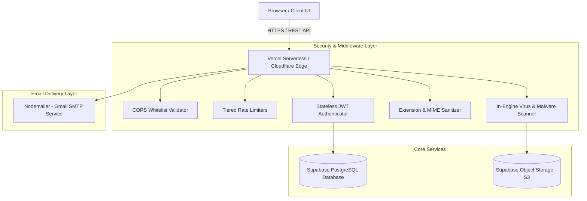
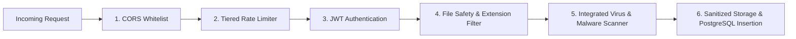

# 🚀 Pocket Drive — Comprehensive Project Documentation & Technical Overview

**Project Name:** Pocket Drive  
**Version:** 2.0.0  
**Authors / Core Team:** Shohag Basak & Md. Mirazul Alam  
**Repository:** [Pocket Drive V1](https://github.com/ShohagBasak/Procket-Drive-V1)  
**Deployment Target:** Vercel Serverless Functions + Supabase Cloud  

---

## 📑 Table of Contents
1. [Overview & Vision](#1-overview--vision)
2. [Complete Tech Stack & Why Each Was Chosen](#2-complete-tech-stack--why-each-was-chosen)
3. [Core Features Breakdown](#3-core-features-breakdown)
4. [Security Architecture & Threat Mitigation](#4-security-architecture--threat-mitigation)
5. [Email Infrastructure & Fallback Strategy](#5-email-infrastructure--fallback-strategy)
6. [Database & Storage Architecture](#6-database--storage-architecture)
7. [API Endpoints Reference](#7-api-endpoints-reference)
8. [Setup, Environment & Deployment Guide](#8-setup-environment--deployment-guide)

---

## 1. Overview & Vision

**Pocket Drive** is a modern, secure, full-stack cloud storage platform designed to give users high-performance personal cloud storage with advanced collaboration, file sharing, and multi-layered threat protection.

It combines the agility of **Node.js/Express** and **Vercel Serverless Functions** with the power of **Supabase (PostgreSQL & S3-compatible Object Storage)**, wrapped in a responsive **Glassmorphism Dark UI**.



---

## 2. Complete Tech Stack & Why Each Was Chosen

| Technology | Role | Why It Was Chosen? |
|---|---|---|
| **Node.js (v18+)** | Runtime Environment | High-performance, asynchronous I/O ideal for concurrent file streams and rapid API execution. |
| **Express.js** | Backend API Framework | Minimalist, battle-tested framework for building modular routes, middlewares, and serverless handlers. |
| **Vercel Serverless** | Cloud Deployment | Ephemeral, scalable execution with near-zero latency worldwide and automatic edge scaling. |
| **Supabase (PostgreSQL)** | Primary Relational DB | Enterprise-grade PostgreSQL with Row Level Security (RLS), instant JSON querying, and high reliability. |
| **Supabase Storage (S3)** | Object File Storage | S3-compatible, secure blob storage supporting direct uploads, secure access tokens, and CDN distribution. |
| **JSON Web Tokens (JWT)** | Authentication | **Stateless Auth:** Allows Vercel Serverless functions to authenticate requests without stateful memory session dependencies. Stored safely in `HttpOnly`, `Secure` cookies (`pd_token`). |
| **Bcrypt.js** | Password Hashing | Cryptographic salting and hashing (10 rounds) ensures irreversible protection of user passwords. |
| **Multer (MemoryStorage)** | File Stream Processing | Handles `multipart/form-data` uploads in memory buffers for real-time security inspection before storage ingestion. |
| **express-rate-limit** | Abuse & DoS Protection | Prevents brute-force credential stuffing, API scraping, and storage flooding attacks. |
| **Nodemailer (Gmail SMTP)** | Transactional Email Engine | Direct SMTP transactional email service for 6-digit OTP verification codes and folder activity alerts. |
| **Vanilla JS & CSS3** | Frontend Stack | Blazing fast, zero-dependency, ultra-lightweight UI with modern Glassmorphism aesthetics, fluid micro-animations, and instant responsiveness. |

---

## 3. Core Features Breakdown

### 🔐 3.1. Authentication & User Management
- **Gmail-Enforced Registration:** Strict email validation restricted to verified Gmail accounts.
- **Secure Password Hashing:** All passwords hashed via `bcryptjs`.
- **Stateless JWT Sessions:** HttpOnly cookies prevent XSS theft of authentication tokens.
- **6-Digit OTP Password Reset:** Time-sensitive (5-minute expiration) one-time codes dispatched via transactional email with in-memory cleanup.
- **Custom Profile Management:** Name updates and avatar image uploading with image-only MIME validation.

### 📁 3.2. File & Folder Management
- **Drag-and-Drop Uploader:** Modern interactive upload zone with live animated progress bars.
- **Nested Folder Hierarchies:** Create unlimited subfolders with dynamic breadcrumb navigation.
- **In-Browser File Preview:**
  - **Images:** `.jpg`, `.png`, `.gif`, `.webp`, `.svg`
  - **Videos:** `.mp4`, `.webm`, `.ogg`
  - **Code & Text:** `.txt`, `.js`, `.json`, `.html`, `.css`, `.md`
- **File Organization:** Rename, move into folders, download, and delete.
- **Trash & Recovery System:** Soft delete mechanism allowing users to restore mistakenly deleted files or permanently remove them.

### 👥 3.3. Collaboration & Sharing
- **Role-Based Folder Sharing:**
  - `Viewer`: Can browse, preview, and download files.
  - `Editor`: Can browse, download, and upload new files into the shared space.
- **Public Share Links:** Unique cryptographic share tokens for external access.
- **Password-Protected Public Shares:** Protect confidential files with an optional access password.
- **Real-Time Collaborator Notifications:** Instant email alerts dispatched to folder owners when collaborators upload new files.

---

## 4. Security Architecture & Threat Mitigation

Pocket Drive implements **Defense-in-Depth (DiD)** to secure both data and infrastructure:



### 4.1. Tiered Rate Limiting (`lib/security.js`)
Protects against automated bot attacks, credential brute-forcing, and resource exhaustion:
1. **Global API Limiter:** 200 requests / 15 minutes per IP.
2. **Auth & OTP Limiter:** 15 requests / 15 minutes per IP (Login, Register, Send OTP, Reset).
3. **Upload Limiter:** 60 uploads / 15 minutes per IP (prevents storage quota flooding).

### 4.2. File Validation & Size Enforcement
- **Strict Size Caps:** Max **50 MB** per file enforced at both client and server buffer levels.
- **Restricted Extension Blacklist:** Dangerous executables and script files are permanently rejected:
  - `.exe`, `.msi`, `.bat`, `.cmd`, `.sh`, `.vbs`, `.scr`, `.pif`, `.com`, `.ps1`, `.reg`
- **Filename Sanitization:** Neutralizes Directory Traversal (`../`) and illegal character injection.

### 4.3. In-Engine Virus & Malware Scanner (`lib/virusScanner.js`)
- **EICAR Signature Detection:** Identifies standard antivirus test signatures (`X5O!P%@AP...`).
- **WebShell & Malicious Payload Inspection:** Scans memory buffers for obfuscated PHP/ASP payloads (e.g. `eval(base64_decode)`, `shell_exec`, `cmd.exe`) disguised as harmless media files.
- **SHA-256 Cryptographic Hash:** Computes unique fingerprints for every upload.
- **VirusTotal API Integration:** Ready for automated multi-vendor hash reputation queries.

---

## 5. Email Infrastructure: Unified Nodemailer Engine

Pocket Drive implements a clean, direct **Nodemailer (Gmail SMTP)** transactional email engine without third-party vendor lock-in:

- **6-Digit Password Reset OTP:** Secure one-time codes generated with 5-minute time-to-live (TTL).
- **Shared Folder Upload Alerts:** Dispatched directly to folder owners when collaborators upload files.
- **Why Single Engine?** Eliminates architectural redundancy, reduces external API dependencies, and ensures straightforward configuration.

---

## 6. Database & Storage Architecture

### 6.1. Database Tables (Supabase PostgreSQL)
- **`users`**: `id`, `email`, `name`, `password` (bcrypt), `profile_picture`, `created_at`
- **`files`**: `id`, `user_id`, `folder_id`, `original_name`, `file_path`, `file_size`, `mime_type`, `is_deleted`, `created_at`
- **`folders`**: `id`, `user_id`, `parent_id`, `name`, `shared_emails` (JSON array of collaborators & roles), `share_token`, `share_password`, `created_at`
- **`folder_shares`**: `id`, `folder_id`, `shared_with_email`, `role` (`viewer` | `editor`), `created_at`

### 6.2. Object Storage (Supabase Storage)
- **Bucket:** `userfiles`
- **Path Structure:** `{storageOwnerId}/{timestamp}_{sanitizedFilename}`
- **Security:** Accessible via signed URLs or public URLs with granular access authorization in API layer.

---

## 7. API Endpoints Reference

### Authentication (`/api/auth`)
| Method | Endpoint | Description | Rate Limit |
|---|---|---|---|
| `POST` | `/api/auth/register` | Register new account (Gmail only) | 15 / 15m |
| `POST` | `/api/auth/login` | Login and receive HttpOnly JWT cookie | 15 / 15m |
| `GET` | `/api/auth/me` | Fetch authenticated user profile | 200 / 15m |
| `POST` | `/api/auth/logout` | Clear auth token cookie | 200 / 15m |
| `POST` | `/api/auth/forgot-password/send-code` | Send 6-digit OTP code to email | 15 / 15m |
| `POST` | `/api/auth/forgot-password/verify-code` | Verify OTP code validity | 15 / 15m |
| `POST` | `/api/auth/forgot-password/reset` | Set new password with verified OTP | 15 / 15m |
| `POST` | `/api/auth/profile/picture` | Upload new user avatar (Image only) | 60 / 15m |

### File Management (`/api/files`)
| Method | Endpoint | Description | Security Check |
|---|---|---|---|
| `POST` | `/api/files/upload` | Upload single file (into root or folder) | Size, Extension, Virus Scan, Rate Limit |
| `GET` | `/api/files/list` | List active files in current folder | JWT Auth Required |
| `GET` | `/api/files/storage-stats` | Get storage quota & used bytes | JWT Auth Required |
| `POST` | `/api/files/delete/:id` | Move file to trash (Soft delete) | Permission Guard |
| `POST` | `/api/files/restore/:id` | Restore file from trash | Permission Guard |
| `DELETE`| `/api/files/permanent/:id` | Permanently remove file from DB & S3 | Owner Guard |
| `GET` | `/api/files/preview/:id` | Get secure streaming preview URL | JWT Auth Required |
| `GET` | `/api/files/public/preview/:id`| Preview file via public share | Token / Password Protected |

### Folder Management (`/api/folders`)
| Method | Endpoint | Description | Access Control |
|---|---|---|---|
| `POST` | `/api/folders/create` | Create folder / subfolder | JWT Auth Required |
| `GET` | `/api/folders/list` | List folders in current directory | JWT Auth Required |
| `POST` | `/api/folders/rename` | Rename existing folder | Folder Owner Only |
| `POST` | `/api/folders/share` | Add/update collaborator roles | Folder Owner Only |
| `POST` | `/api/folders/public-link`| Generate public share link & password | Folder Owner Only |
| `DELETE`| `/api/folders/delete/:id` | Delete folder & nested items | Folder Owner Only |

---

## 8. Setup, Environment & Deployment Guide

### 8.1. Environment Variables (`.env`)
```env
PORT=3000
NODE_ENV=development
APP_URL=http://localhost:3000

# Supabase Credentials
SUPABASE_URL=https://your-project.supabase.co
SUPABASE_ANON_KEY=your-supabase-anon-key
SUPABASE_SERVICE_ROLE_KEY=your-supabase-service-role-key

# JWT Secret
JWT_SECRET=your-super-secret-jwt-key

# Primary Email (Gmail SMTP)
GMAIL_USER=your-email@gmail.com
GMAIL_APP_PASSWORD=your-gmail-app-password

# Optional VirusTotal Cloud Scanner
VIRUSTOTAL_API_KEY=your_virustotal_api_key

# Upload Limits
MAX_FILE_SIZE_MB=50
```

### 8.2. Running Locally
```bash
# 1. Install dependencies
npm install

# 2. Start development server
npm run dev
```
Visit `http://localhost:3000` in your browser.

---

© 2026 **Pocket Drive** — High Performance Secure Cloud Storage.
