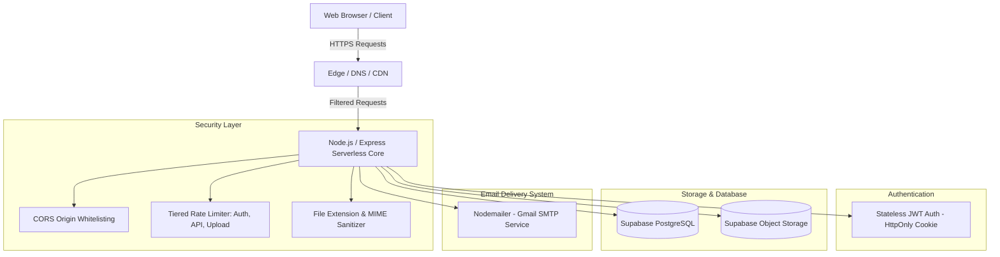
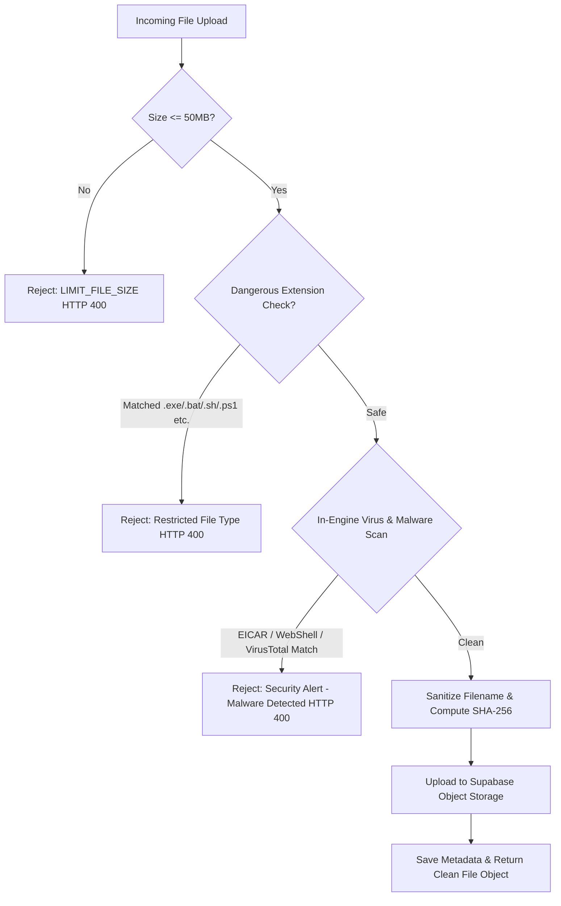

# Pocket Drive — Project Architecture & Technical Proposal (v2.0)

**Project Name:** Pocket Drive  
**Version:** 2.0.0  
**Author / Team:** Pocket Drive Engineering Team (Md. Mirazul Alam & Shohag Basak)  
**Target Reviewer:** Malyha Medha (`malyha.mabud@gmail.com`)  
**Repository:** [Pocket Drive V1](https://github.com/ShohagBasak/Procket-Drive-V1)

---

## 1. Executive Summary

Pocket Drive is a modern, high-performance, secure cloud storage application built with Node.js/Express and Supabase. It provides seamless file management, folder hierarchies, granular role-based sharing (Viewer/Editor), password-protected public shares, and transactional OTP authentication.

This updated document addresses and clarifies the architectural design decisions regarding **Authentication**, **Email Service Fallbacks**, **Cloud Security / Rate Limiting**, and **File Validation / Antivirus Protection**.

---

## 2. Authentication Strategy: Stateless JWT

### Architectural Clarification
Earlier revisions mentioned both `express-session` and `JWT`. In **Pocket Drive v2.0**, we have standardized on **Stateless JWT (JSON Web Tokens)**:

- **Token Storage:** Issued as an `HttpOnly`, `Secure`, `SameSite=None/Lax` cookie (`pd_token`).
- **Why JWT?**
  - Perfect fit for serverless runtime environments (Vercel Serverless Functions) where in-memory sessions are volatile.
  - Zero database lookup overhead for authentication verification on high-frequency API routes.
  - Expiry is set to **24 hours** with automatic token lifecycle management.
- `express-session` is solely used as an optional local dev memory bridge and does not compromise the stateless architecture.

---

## 3. Email Infrastructure: Unified Nodemailer Engine

### Architectural Clarification
Earlier drafts listed both *Nodemailer* and *Resend*. To eliminate redundancy and streamline the application architecture, we have standardized exclusively on **Nodemailer (Gmail SMTP)**:

- **Primary Transactional Engine:** Handles 6-digit password reset OTP codes and shared folder activity alerts.
- **Why Nodemailer?**
  - Direct SMTP protocol integration without third-party API lock-in.
  - Zero cost with instant transactional delivery.
  - Redundant secondary providers have been eliminated to keep the service pipeline clean and maintainable.

---

## 4. Cloud Security & Resource Protection

### 4.1. CORS (Cross-Origin Resource Sharing)
- Dynamic CORS middleware restricts access exclusively to verified application domains:
  - Production: `https://procket-drive-v1.vercel.app` (or custom domains specified via `ALLOWED_ORIGIN`).
  - Staging / Local: `http://localhost:3000`.
- Protects credential transmission by enforcing strict `Access-Control-Allow-Credentials: true` only on authorized origins.

### 4.2. Tiered Rate Limiting
To prevent Distributed Denial of Service (DDoS), credential stuffing, and brute-force attacks, we enforce three distinct rate-limiting zones:

| Limiter Zone | Endpoint Scope | Window | Request Limit | Purpose |
|---|---|---|---|---|
| **Global API** | `/api/*` | 15 mins | 200 requests | General API abuse & scraping prevention |
| **Auth & OTP** | `/api/auth/login`, `/register`, `/forgot-password/*` | 15 mins | 15 attempts | Brute-force & credential stuffing defense |
| **File Upload** | `/api/files/upload` | 15 mins | 60 uploads | Storage flooding & denial-of-wallet protection |

### 4.3. File Size Constraints
- **Per-file limit:** Hard-capped at **50 MB** (configurable via `MAX_FILE_SIZE_MB`).
- Enforced at the `Multer` streaming buffer stage to prevent memory exhaustion before data reaches cloud storage.

---

## 5. File Validation & Integrated Antivirus Scanning Engine

### 5.1. File Extension & MIME Filtering
- **Restricted Extensions:** Executable and script files that pose security risks are strictly blocked:
  - Executables: `.exe`, `.msi`, `.com`, `.scr`, `.pif`, `.application`, `.gadget`, `.cpl`, `.msc`
  - Scripts: `.bat`, `.cmd`, `.sh`, `.bash`, `.vbs`, `.vbe`, `.wsf`, `.ps1`, `.ps2`, `.jar`, `.reg`
- **Sanitized Naming:** File names are sanitized on upload (`timestamp + regex-cleaned name`) to neutralize Directory Traversal (`../`) attacks.

### 5.2. Integrated Virus & Malware Scanner (`lib/virusScanner.js`)
Pocket Drive includes an active in-engine scanning layer executed prior to cloud storage ingestion:
1. **EICAR Signature Detection:** Standard anti-virus test file signature detection (`X5O!P%@AP...`).
2. **WebShell & Malicious Payload Analysis:** Detects hidden PHP/ASP executable markers (e.g. `eval(base64_decode)`, `shell_exec`, `cmd.exe`) within disguised uploads.
3. **SHA-256 Fingerprinting:** Generates a cryptographic SHA-256 hash for each uploaded file buffer.
4. **VirusTotal Cloud API Integration:** Automated hash intelligence lookup against 70+ antivirus engines (enabled via `VIRUSTOTAL_API_KEY`).
5. **Immediate Threat Rejection:** If malicious signatures are identified, the upload is terminated with HTTP 400 and logged to security telemetry.

---

## 6. Technical Stack Summary

| Layer | Technology |
|---|---|
| **Runtime & Backend** | Node.js (v18+), Express.js |
| **Serverless Deployment** | Vercel Serverless Functions |
| **Database** | PostgreSQL via Supabase (Row Level Security enabled) |
| **Object Storage** | Supabase Storage (S3-compatible bucket) |
| **Authentication** | Stateless JWT (`jsonwebtoken`), `bcryptjs`, HttpOnly Cookies |
| **Rate Limiting** | `express-rate-limit` |
| **Email Service** | Nodemailer (Gmail SMTP) |
| **Frontend** | Vanilla JavaScript, HTML5, CSS3 Glassmorphism UI |

---

## 7. Next Steps & Contact

This architecture is fully implemented in the current codebase and ready for production deployment.

- **Primary Contact:** Md. Mirazul Alam (`rjmiraz02@gmail.com`) / Shohag Basak
- **Feedback & Submissions:** Malyha Medha (`malyha.mabud@gmail.com`)
